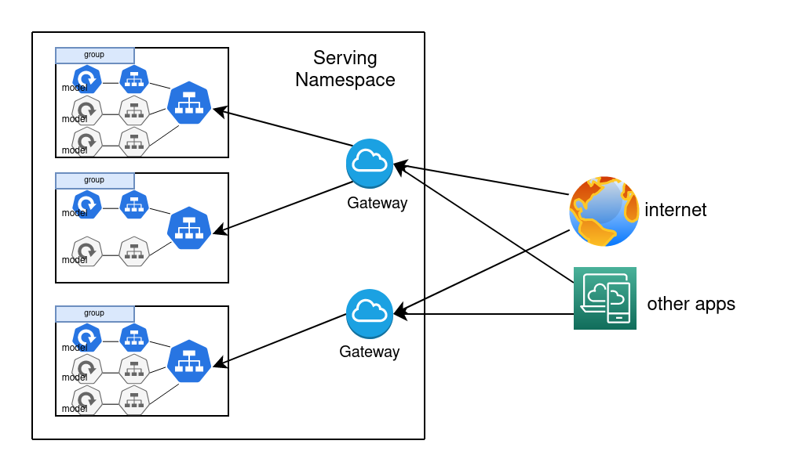

# Serving Frontend

UI should let a user easily check deployed models, deploy new models or remove existing ones.

Initially, the frontend should support these tabs:

- **models**
  - list of all deployed models
  - shows some additional information about a model
  - lets a user remove a model from serving
- **groups**
  - list of all existing model groups
  - lets a user change modes of models belonging to a group
  - lets a user create/delete a model group
- **gateways**
  - list of all existing gateways
  - lets a user create/delete a gateway

Additionally, to tabs, we can add a Deploy button to enter a configuration page for adding a new model.

## Tools

React + MUI ?

---

### Go back to [Serving](../)
